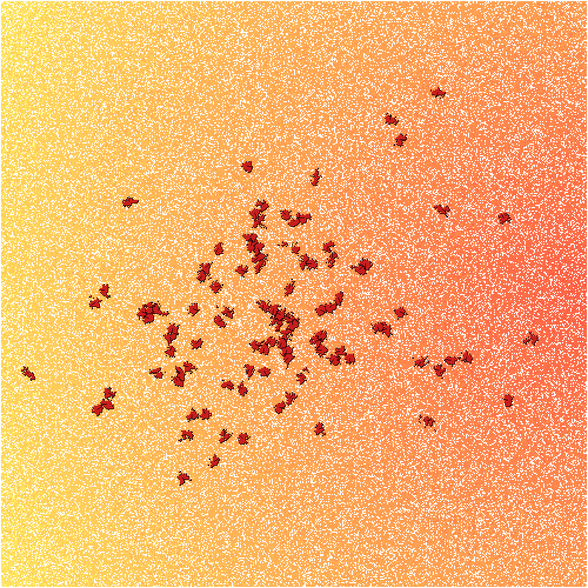

# Cell Simulation
This work is based on the Cell_Evolution_stickymoves repository (https://github.com/escolizzi/Cell_Evolution_stickymoves) which contains the experiments of the paper "Evolution of multicellularity by collective integration of spatial information". We enhance usability of the original code and provide wrapper functions that enable execution of experiments in a Python environment. Furthermore, we implement surrogate models to investigate several questions regarding the properties of the original simulation.

# Compiling the Simulation
In this section, we describe the steps necessary to compile the C++ code of the simulation. We will give examples for Linux 
1. If necessary install GCC or G++
2. Install QMake
    ```
    sudo apt install build-essential
    sudo apt install qtcreator
    sudo apt install qt5-default
    ```
    qt5-default is not available for some operating systems; see https://askubuntu.com/questions/1335184/qt5-default-not-in-ubuntu-21-04 for a workaround

3. Build the C++ files 
    ```
    cd src
    qmake CellularPotts2.pro
    qmake -j
    ```
    If qmake is unavailable try ```sudo apt install qt5-qmake```

Now you should be ready to go! 


# Running the Simulation

Note that all scripts must be run from the scripts folder. To execute a single simulation run use the command 
```bash 
sh bash_scripts/run_simulation.sh -<config> -<identifier>
```
Parameters:

* ```<config>``` is the name of the configuration file as located in /data/parameters containing the simulation parameters.
* ```<identifier>``` is an integer used to identify the simulation's outputs. After the run is finished they will be stored in ```/data/output/data_cellcount_\<identifier\>.txt```

# Python Wrapper Functions
Experiments can be set up and run from Python using the ```/scripts/dataprocessing/start_experiment.py``` module. It enables the creation of a config file based on updating parameters from a baseline parameter set read from ```baseline_parameters.par```. Furthermore, provides an interface for running the simulation given a config file. 

## Post-processing of Simulation Results
The ```/scripts/dataprocessing/read_data.py``` data module allows to read in the output of an experimental run and to extract many of properties of the results. These include the number of multi-cellular structures ("blobs") at each time step and their sizes. 

# Building surrogate models
Methods realting to surrogate modelling are implemented in the ```/scripts/dataprocessing/gaussian.py``` module. These include methods for running latin hypercube sampling on the simulation, the fitting of a gaussian process (GP) wrapped by an emukit model, the visualization of a GP, and calculation of the sobol indices for sensitivity analysis. 

In the data folder we provide the parameters and results of almost 300 simulation runs. The purpose of this is to empower users to initialize and build their own surrogate models.

Tutorials are provided in the form of jupyter notebooks in the /scripts/notebooks folder. Furthermore, it contains the source code of several surrogate models as well as their analysis that enables a deeper understanding of several properties of the original simulation.

# Details on the Simulation 
* Adhesion between cells is largely determined by the cell-cell binding energy, which is, in turn, determined by the number of bits that are the same between the ligand and receptor. If there are n bits in common, then the cell-cell binding energy is 2n+4, where 4 is the minimum cell-cell binding energy for neighboring cells. Lower energies lead to more adhesion
* Cells move at 0.0055 px/time step. 
* The simulation is run based on 81 parameters. The subsection below, gives a brief overview.

## Parameters

*General:*
* **mcs** : "monte carlo steps" defines the maximum time steps for the simulation; takes about 1hour per 100000 timesteps; ***MUST BE*** multiple of 25
* **season_duration** : how many time steps a season lasts
* **gridx** and **gridy** : * define the grid size (default: 500 * 500)
* **mut_rate** : mutation rate of a single gene in the key or lock of a cell; typical key and lock size is 10 + 10, therefore, a mut_rate=0.025 leads to 20 * 0.025 = 0.5 an expected one mutation every two time steps 
* **gradnoise** : controls the noise of the (food source) gradient detection by individual cells (default: 0.9); deterministic if 0.0
* **T** : Boltzman temperature; basically says how likely things are to happen, even if they're improbable (large temperatures allow for even unlikely states to occur) 
* **target_area** : How large each cell should aim to be
* **lambda** : Cell stiffness; basically says how much a cell wants to get back to it's target area
* **min_area_for_life** : Below this size, a cell will die/apoptose
* **neighbors** : How many neighbors can a predator eat? When it's 2, it represents Moore neighborhood (default: 0)
* **evolsim** : If 1 then the simulation terminates after a single seasons
* **chancemediumcopied** : Chance that instead of copying pixel with another, we copy from outer space instead
* **food_influx_location** : Where can food be; there's prespecified values for this such as specified_experiment, food_growth, everywhere, etc.
3. **gradscale** : Scaling the gradient up and down
4. **is_there_food** : Is there food in the experiment?
5. **initial_food_amount** : How much food is there initially?
6. **foodinflux** : Probability of there being food in a particular location
7. **eatprob** : If we're on food, what's the probability we eat it

* **keylock_list_filename** : ?
    * Alternatively, we have a parameter **gamma** that says what the difference between files should be; ```gamma=0``` corresponds to the file [KL_same_0.dat](https://github.com/naveenr414/cell-simulation/blob/main/data/keylock/KL_same_12.dat)**

*Initialization:*

1. **howmany_makeit_for_nextgen** : How many cells make it with each generation
2. **popsize** : Population size at each generation; if this is 100, and howmany.. Is 50, then each cell splits in two afterwards
3. **n_init_cells** : How many cells there are initially
4. **size_init_cells** : How large the cells are initially (must be above 30)
5. **the_line** : Radius of cells that make it to the next generation
6. **rseed** : Random seed

*Output:*

4. **datadir** : Where to store the images
5. **save_text_file_period** : How often to write the data text file
6. **save_backup_period** : How often to back up information
7. **backupdir** : Where to save the backup to
8. **readcolortable** : Should we generate a new colortable
9. **colortable_filename** : Where is the colortable file that we read from


## Outputs

The simulation has two outputs. Firstly, a folder ```src/data_film_<identifier>``` is created that contains images visualizing the state of the simulation every 1000 time steps. 

For example: 

 

To combine the output pictures from the latest run into an mp4 video, run the following command from the scripts folder
```
bash bash_scripts/create_video.sh 
```
This results in a 10 FPS video called video.mp4 in the same folder as the images 


Secondly, the result data is written into ```/data/output/data_cellcount_<identifier>.txt```.
The result file is formatted as follows: Each line contains information on one of the cells at a given time step. 

**Example Line:** 0 1 1 212.771 212.438 0.998477 0.0551726 0.793482 0.608593 1 100110101011000110001110 001111000100011101110001 3 0 1 1 0 0 0 1 1 0 0 0 0 0 1 1 0 0 0 0 14 1 16 1 16

1. 0 - Time period
2. 1 - Sigma, spin identifier, which basically says what cell each is
3. 1 - Tau, cell type
4. 212.771 - Y position (the first one is Y position according to single cell exploration) 
5. 212.438 - X Position
6. 0.998477 - X vector (Persistent Migration)
7. 0.0551726 - Y vector (Persistent Migration)
8. 0.793482 - Chem X vector (Chemotaxis)
9. 0.608593 - Chem Y Vector (Chemotaxis)
10. 1 - Time Since Birth
11. 100110101011000110001110 - J Key
12. 001111000100011101110001 - J Lock (used for adhesion)
13. 3 - Mu, persistent migration strength
14. 0 - How many particles there are
15. 1 - Either the maintenance fraction or the fraction of expressed surface proteins
16. 1 - Scaling factor (k_mf_0)
17. 0 - Scaling factor for Adhesion
18. 0 - Scaling factor for Persistent Migration
19. 0 - Scaling factor for chemotaxis
20. 1 - Maintenance factor using k_ext - ?
21. 1 - k_ext_0 - ?
22. 0 - k_ext_A - ?
23. 0 - k_ext_P - ?
24. 0 - k_ext_C - ?
25. 0 - k_ext_0t - ?
26. 0 - k_ext_Pt - ?
27. 1 - Maintenance Fraction using chemotaxis - ?
28. 1 - k_chem_0 - ?
29. 0 - k_chem_A - ?
30. 0 - k_chem_P - ?
31. 0 - k_chem_C - ?
32. 0 - Neighbors cell type
33. 14 - Neighbors energy difference (?)
34. 1 - Neighbors Cell Type
35. 16 - Neighbors Energy Difference
36. 1 - Neighbors Cell Type
37. 16 - Neighbors Energy Difference
